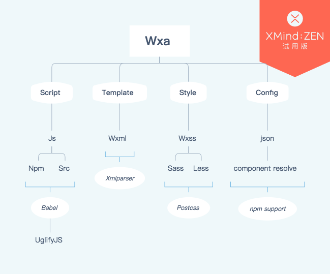

# wxa-cli
[](https://www.npmjs.com/package/@wxa/cli)

为小程序开发定制的命令行工具



## 特性
- Npm支持
- 原生开发模式
- Vue单文件开发模式
- 插件机制
- 个性化编译器
- 原生组件支持
- 第三方原生组件
- 调用微信开发者工具

## 安装
使用 `npm` 安装: `npm i -g @wxa/cli`

## 用例
1. 基础编译
`wxa build`

2. 监听模式
`wxa build --watch`

3. 指定无效缓存以及打印更详细的构建信息
`wxa build --no-cache --verbose`

4. 使用模板创建新项目, [template](#Template)
`wxa create base projectname`

5. 调用微信开发者工具, windows用户需要在`wxa.config.js`设置开发者工具的路径`wechatwebdevtools`
- `wxa cli open`: 打开开发者工具
- `wxa cli preview`: 预览项目
- `wxa cli upload -m 'upload msg' --ver 'verion'`: 上传项目
- `wxa cli login`: 登录微信，`preview`和`upload`都需要登录微信后操作

## 配置

核心的配置文件是`wxa.config.js`,一般来讲都是长下面这样:

```javascript
const path = require('path');
const UglifyjsPlugin = require('@wxa/plugin-uglifyjs');
const ReplacePlugin = require('@wxa/plugin-replace');
let prod = process.env.NODE_ENV === 'production';
const envlist = []; // your env configurations

module.exports = {
    wechatwebdevtools: '/Applications/wechatwebdevtools.app', // path to your wechat dev tool
    resolve: {
        alias: {
            '@': path.join(__dirname, 'src'),
        },
    },
    use: ['babel', 'sass', 'stylus'],
    compilers: {
        sass: {
            // compiler options
        },
    },
    plugins: [
        new ReplacePlugin({
            list: envlist,
        }),
    ],
};

if (prod) {
    module.exports.plugins.push(new UglifyjsPlugin());
}

```

### 配置项
#### use 
指定加载对应的compiler如`babel`，则cli将自动加载项目依赖中的`@wxa/compiler-babel`。
目前支持的compiler有：
- [`@wxa/compiler-babel`](https://github.com/Genuifx/wxa-compiler-babel)
- [`@wxa/compiler-sass`](https://github.com/Genuifx/wxa-compiler-sass)
- [`@wxa/compiler-stylus`](https://github.com/Genuifx/wxa-compiler-stylus)

#### compilers
个性化compiler的配置

#### resolve
解析配置
- alias：别名，仅解析js的时候生效

#### plugins
插件，cli通过使用`webpack`最新的`tapable`实现插件机制
目前支持的插件有：
- [`@wxa/plugin-replace`](https://github.com/Genuifx/wxa-plugin-replace)
- [`@wxa/plugin-uglifyjs`](https://github.com/Genuifx/wxa-plugin-uglifyjs)

## 编辑器
推荐使用 [vsCode](https://github.com/Microsoft/vscode)，原来写代码可以如此顺畅.
推荐使用 [vetur](https://github.com/vuejs/vetur) 高亮`.wxa` 文件.
下面是推荐的vscode项目配置：
```json
{
    "javascript.implicitProjectConfig.experimentalDecorators": true,
    "vetur.grammar.customBlocks": {
    "config": "json"
  },
  "vetur.validation.template": false,
  "eslint.enable": true
}
```
以及一些eslint的配置示例：
```json
{
    "extends": [
        "./node_modules/eslint-config-google/index.js"
    ],
    "root": true,
    "env": {
        "commonjs": true,
        "es6": true,
        "node": true
    },
    "parser": "vue-eslint-parser",
    "parserOptions": {
        "parser": "babel-eslint",
        "ecmaFeatures": {
            "experimentalObjectRestSpread": true
        },
        "ecmaVersion": 2017,
        "sourceType": "module"
    },
    "rules": {
        "vue/valid-template-root": "off",
        "no-const-assign": "warn",
        "valid-template-root": "off",
        "no-this-before-super": "warn",
        "no-undef": "warn",
        "no-unreachable": "warn",
        "no-unused-vars": "warn",
        "constructor-super": "warn",
        "valid-typeof": "warn",
        "one-var": "warn",
        "max-len": "off",
        "no-trailing-spaces": "off",
        "require-jsdoc": "warn",
        "camelcase": "warn",
        "no-invalid-this": "warn",
        "new-cap": "warn",
        "guard-for-in": "warn"
    }
}
```

## 模板
模板用于创建新的wxa项目
目前支持的模板：
1. [Base Template](https://github.com/Genuifx/wxa-template-base)

## 原生组件解析
wxa支持项目直接从npm中引入第三方的组件！

```js
// in your page's config.json
{
    "usingComponents": {
        "counting": "@wxa/ui/src/components/counting"
    }
}
```
编译后的结果为：
```js
{
    "usingComponents": {
        "counting": "./../npm/@wxa/ui/src/components/counting"
    }
}
```
[wxa-ui](https://github.com/Genuifx/wxa-ui)也在不断完善中
